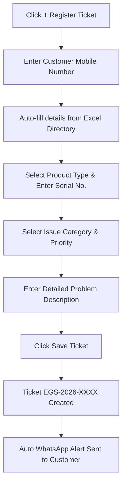

# 🌿 Eco Green Solar CMS — Complete SaaS Operating Guide & Feature Manual

Welcome to the official **Standard Operating Procedure (SOP) & Feature Walkthrough Guide** for **Eco Green Solar CMS (Complaint Management System)**.

This guide provides end-to-end instructions on how to operate every screen, role, and feature in the software.

---

## 📑 Table of Contents
1. [System Architecture & Roles](#1-system-architecture--roles)
2. [Login & Authentication Portal](#2-login--authentication-portal)
3. [Complaints Dashboard (Command Center)](#3-complaints-dashboard-command-center)
4. [How to Register a New Ticket](#4-how-to-register-a-new-ticket)
5. [Assigning & Managing Complaints](#5-assigning--managing-complaints)
6. [Technician Field View Portal](#6-technician-field-view-portal)
7. [WhatsApp Web Communication Hub](#7-whatsapp-web-communication-hub)
8. [Team Management (Staff, Techs & Admins)](#8-team-management-staff-techs--admins)
9. [Product Catalog & Categories](#9-product-catalog--categories)
10. [Executive Analytics & SLA Dashboard](#10-executive-analytics--sla-dashboard)
11. [Automated Notification Templates](#11-automated-notification-templates)
12. [Step-by-Step SaaS Video Script for Screen Recording](#12-step-by-step-saas-video-script-for-screen-recording)

---

## 1. System Architecture & Roles

Eco Green Solar CMS is built for Solar Rooftop Systems, Solar Water Heaters, and Heat Pumps with **Role-Based Access Control (RBAC)**:

| Role | Access Level | Primary Duties |
| :--- | :--- | :--- |
| **🛡️ Administrator** | **Full System Control** | Manage all tickets, assign staff/techs, view analytics, reset passwords, edit catalogs, view WhatsApp chats. |
| **👥 Office Staff** | **Front Desk / Support** | Register tickets, search customer history, assign field visits, send notifications. |
| **🔧 Field Technician** | **Mobile / Field Portal** | Receive assigned jobs, update on-site status, upload resolution photos, collect customer feedback. |
| **👤 End Customer** | **Self-Service Portal** | Track live ticket status via tracking link (`/track-complaint`), submit ratings & feedback. |

---

## 2. Login & Authentication Portal
- **Web URL:** `https://complain.ecogreensolar.co.in/login`
- **Default Master Admin Login:**
  - **User ID / Mobile / Email:** `admin` or `6352454247`
  - **Password:** `admin3636`
- **Features:**
  - Quick multi-format login (Username, Phone Number, or Corporate Email).
  - Role-based redirect (Admin/Staff redirected to Complaints Hub; Technicians redirected to Field View).
  - Auto session token persistence with secure logout.

---

## 3. Complaints Dashboard (Command Center)
Accessible via **Complaints** in the top navigation bar.

### Key Metrics & Status Bar:
The top section features real-time count cards for every lifecycle state:
1. **Registered (Yellow):** New incoming complaints awaiting technician assignment.
2. **Assigned (Blue):** Technician allocated and visit scheduled.
3. **In Progress (Purple):** Technician is currently at customer site repairing the system.
4. **On Hold (Amber):** Waiting for replacement parts (inverters, solar panels, sensors) or customer availability.
5. **Resolved (Emerald):** Service completed and documented.
6. **Closed (Slate):** Verified and closed with customer satisfaction sign-off.
7. **Reopened (Rose):** Re-flagged if the issue reoccurs.

### Powerful Filters & Search:
- **Search Bar:** Live search by Ticket ID (`EGS-2026-XXXXXX`), Customer Name, Mobile Number, or Solar Product Serial Number.
- **Filters:** Filter by Status, Priority (Urgent, High, Medium, Low), and Product Category.
- **Export to Excel:** Download filtered complaint reports for management review.

---

## 4. How to Register a New Ticket
Click the **`+ Register Ticket`** emerald button in the top navigation bar:

### Steps to Fill:
1. **Customer Mobile Number:** Type the 10-digit number. If the customer exists in the 6,100+ customer master database, their Name, Address, and City will automatically populate!
2. **Product Type:** Choose between *Solar Rooftop Systems*, *Solar Water Heaters*, or *Heat Pumps*.
3. **Warranty Status:** Tagged as *In Warranty* or *Out of Warranty*.
4. **Issue Category:** e.g., *Inverter Error / Grid Trip*, *Zero Generation*, *Panel Physical Damage*, *Leakage / Low Temperature*.
5. **Priority:** Select *Urgent (24h SLA)*, *High*, *Medium*, or *Low*.
6. **Save Ticket:** The ticket is instantly generated and assigned an immutable ID.

---

## 5. Assigning & Managing Complaints
Click on any ticket row in the dashboard to open the **Complaint Detail Drawer**:

- **Technician Assignment:**
  - Select an available technician from the dropdown.
  - Set the **Expected Visit Date & Time Window**.
  - Click **Confirm Assignment**.
  - A WhatsApp dispatch message is automatically triggered to both technician and customer.
- **Timeline & Notes:**
  - View chronologically ordered timeline logs (Ticket Created → Assigned → Technician Arrived → Resolved).
  - Add internal supervisor notes visible only to the office team.
- **Direct WhatsApp Messaging:**
  - Click the **WhatsApp Icon** on the customer card to open instant chat with pre-filled status updates.

---

## 6. Technician Field View Portal
Accessible via **Field View** in the top navigation bar (`/technician`):

Designed specifically for on-site field engineers on smartphones and tablets:
1. **Duty Toggle:** Technician can switch between **🟢 On-Duty** and **⚪ Off-Duty**.
2. **My Active Visits:** Cards showing customer name, location with one-click Google Maps navigation, phone calling, and system details.
3. **Starting the Job:** Click **"Start Work"** to transition status to *In Progress*.
4. **Resolution Documentation:**
   - Record parts used (e.g., MC4 connectors, 50A breaker, temperature sensor).
   - Enter technician remarks.
   - Upload resolution photo proof.
5. **Job Completion & Closure:** Collect customer OTP or signature to mark the ticket **Resolved**.

---

## 7. WhatsApp Web Communication Hub
Accessible via **WhatsApp Web** in the top navigation:

- **Inbox Interface:** Mimics standard WhatsApp Web with contact list, search, and active chat panel.
- **Date Separators & Timestamps:** Chat history clearly divides messages with date badges (*"Today"*, *"Yesterday"*, or *"25 Sep 2026"*) and message delivery timestamps.
- **Fast Ticket Linking:** Click any chat to see if the contact has an active solar complaint ticket.
- **Pre-Approved Templates:** Send 1-click status updates, warranty notices, and payment receipts directly through the chat.

---

## 8. Team Management (Staff, Techs & Admins)
Accessible via **Staff & Techs** (`/team`):

Organized into four dedicated tabs:
1. **🔧 Technicians:**
   - Displays all field staff with availability badges (On-Duty / Off-Duty).
   - View cash-in-hand collected, active tickets count, and average customer star ratings.
   - **Reset Key:** Instantly generate strong login passwords and copy formatted credentials for WhatsApp sharing.
2. **👥 Office Staff:**
   - Displays support desk coordinators handling complaints and assignments.
   - Edit user information and configure permissions.
3. **🛡️ Administrators:**
   - Displays primary system administrators with Full Access badges.
   - Protected admin controls, credential management, and supervisor tools.
4. **📦 Catalog & Categories:**
   - Add new solar equipment models, brands, and configure issue categories.

---

## 9. Product Catalog & Categories
Located within the **Staff & Techs → Catalog & Categories** tab:
- **Product Models:** Configure systems like *On-Grid Rooftop Solar*, *Off-Grid Hybrid Solar*, *Commercial Heat Pumps*.
- **Issue Categories:** Customize common diagnostic issues (e.g., Inverter Failure, Earthing Fault, High Pressure Valve Fault).

---

## 10. Executive Analytics & SLA Dashboard
Accessible via **Analytics** in the top navigation (`/analytics`):

- **SLA Resolution Performance:** Real-time calculation of average resolution turnaround time (e.g., 18.5 hours).
- **Product Defect Distribution:** Donut charts illustrating which equipment types generate the most service requests.
- **Technician Leaderboard:** Ranking field technicians based on:
  - Total tickets resolved.
  - On-time SLA rate.
  - Customer review average (out of 5.0 stars).
- **Customer Satisfaction (CSAT):** Overall score derived from automated customer feedback ratings.

---

## 11. Automated Notification Templates
Accessible via **Templates** in the top navigation (`/templates`):

Pre-configured standard messages with auto-fill placeholders (`{customer_name}`, `{ticket_id}`, `{technician_name}`, `{technician_phone}`, `{tracking_link}`):
1. **Ticket Registration Alert:** Confirms complaint receipt with unique ticket ID.
2. **Technician Assigned Alert:** Shares technician name, mobile number, and expected arrival date.
3. **Resolution & Feedback Request:** Notifies customer of repair completion and invites star ratings.

---

## 12. Step-by-Step SaaS Video Script for Screen Recording

If you are creating a screen recording video (using OBS Studio, Loom, or Windows Game Bar `Win + G`), follow this professional **2-minute SaaS demo flow**:

| Time | Screen / Tab | Action & Narration |
| :--- | :--- | :--- |
| **0:00 - 0:15** | `https://complain.ecogreensolar.co.in/login` | Show login page. Type `admin` and `admin3636`. Click Login. *"Welcome to Eco Green Solar CMS — the unified complaint and field service platform."* |
| **0:15 - 0:35** | **Complaints Dashboard** | Highlight ticket status counters. Click `+ Register Ticket`. Show customer auto-fill and priority selection. Close modal. Open an existing ticket drawer to show timeline and assignment. |
| **0:35 - 0:50** | **Field View** | Click `Field View`. Show mobile technician view, active jobs, Google Maps action, and resolution workflow. |
| **0:50 - 1:10** | **WhatsApp Web** | Click `WhatsApp Web`. Click customer chat. Scroll to show date dividers (*"Today"* / timestamps) and 1-click status messages. |
| **1:10 - 1:30** | **Staff & Techs** | Click `Staff & Techs`. Cycle through `Technicians`, `Office Staff`, and `Administrators`. Show the dedicated Admin Supervisor card and the Reset Key tool. |
| **1:30 - 1:50** | **Analytics** | Click `Analytics`. Scroll through SLA resolution graphs, technician leaderboards, and customer satisfaction ratings. |
| **1:50 - 2:00** | **Templates & Wrap-up** | Click `Templates`. Show dynamic WhatsApp/SMS notification triggers. Return to Complaints Dashboard. |

---
*Created for Eco Green Solar CMS — Official Documentation 2026*
